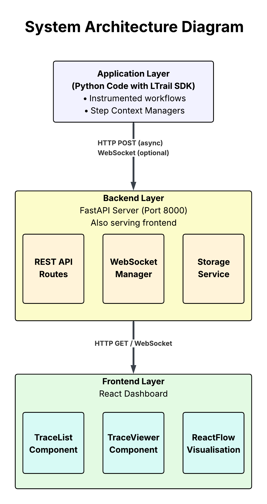
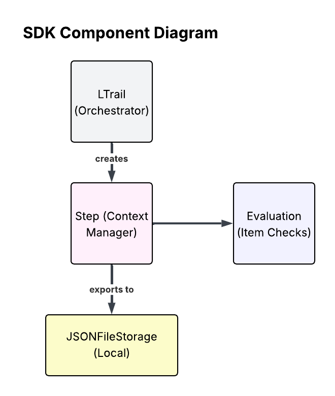

# LTrail - X-Ray for Multi-Step Decision Systems

LTrail is a comprehensive debugging system for non-deterministic, multi-step algorithmic processes. It provides transparency into decision-making by capturing context at each step: inputs, candidates, filters applied, outcomes, and reasoning.

## Architecture

The project consists of three main components:

1. **SDK** (`sdk/`) - Python library for instrumenting your code
2. **Backend** (`backend/`) - FastAPI server with WebSocket support for real-time updates
3. **Frontend** (`frontend/`) - React dashboard with ReactFlow visualization

### High-Level Architecture



### SDK Component Architecture




## Quick Start

> **Note**: For detailed step-by-step instructions, see [RUN.md](RUN.md)

### 1. Start the Backend

```bash
cd backend

# Create and activate virtual environment (recommended)
python -m venv venv
# Windows PowerShell:
.\venv\Scripts\Activate.ps1
# Windows CMD:
venv\Scripts\activate.bat
# Linux/Mac:
source venv/bin/activate

# Install dependencies
pip install --upgrade pip
pip install -r requirements.txt

# Start the server
python main.py
```

The backend will run on `http://localhost:8000`

**Troubleshooting**: If you get pydantic build errors (especially on Python 3.13), try:

```bash
pip install "pydantic>=2.9.0" --only-binary :all:
```

### 2. Start the Frontend

```bash
cd frontend
npm install
npm start
```

The frontend will run on `http://localhost:3000`

### 3. Run the Example

```bash
cd sdk

# Install SDK (first time only)
pip install -e .

# Set your Gemini API key
# Windows PowerShell:
$env:GEMINI_API_KEY='your-api-key'
# Windows CMD:
set GEMINI_API_KEY=your-api-key
# Linux/Mac:
export GEMINI_API_KEY='your-api-key'

# Run the example
python examples/competitor_selection.py
```

## Features

### SDK Features

- **Lightweight Integration**: Simple context manager API
- **Failure Handling**: Robust error detection and reporting (including API rate limits)
- **Real-time Updates**: Automatic step updates sent to backend
- **Multiple Storage Backends**: JSON file storage and HTTP backend client

### Backend Features

- **REST API**: Full CRUD operations for traces
- **WebSocket Support**: Real-time trace updates
- **In-memory Storage**: Fast access (can be replaced with database)

### Frontend Features

- **ReactFlow Visualization**: Interactive flow diagrams
- **Real-time Updates**: WebSocket connection for live trace updates
- **Step Details**: Detailed view of inputs, outputs, and evaluations
- **Tailwind CSS**: Modern, responsive UI

## Usage

### Basic SDK Usage

```python
from ltrail_sdk import LTrail, BackendClient

# Initialize backend client
backend_client = BackendClient(base_url="http://localhost:8000")

# Start a trace
ltrail = LTrail.start_trace(
    name="My Workflow",
    metadata={"environment": "production"}
)

# Add steps
with ltrail.step("step_name", step_type="logic") as step:
    step.log_input({"data": "input"})
    # ... your code ...
    step.log_output({"result": "output"})
    step.set_reasoning("Why this decision was made")

    # Send real-time update
    backend_client.send_step_update(ltrail.trace_id, step.to_dict())

# Complete trace
ltrail.complete(final_output={"result": "final"})
backend_client.send_trace(ltrail)
```

### Environment Variables

- `GEMINI_API_KEY`: Required for the example (Gemini API key)
- `LTRAIL_BACKEND_URL`: Optional, defaults to `http://localhost:8000`

## Project Structure

```
logictrail/
├── sdk/
│   ├── ltrail_sdk/          # SDK package
│   │   ├── core.py          # Core classes (LTrail, Step, Evaluation)
│   │   ├── backend_client.py # HTTP client for backend
│   │   ├── storage.py        # Storage backends
│   │   └── exceptions.py    # Custom exceptions
│   └── examples/            # Example applications
├── backend/
│   ├── main.py              # FastAPI application
│   └── requirements.txt     # Python dependencies
└── frontend/
    ├── src/
    │   ├── App.jsx          # Main React component
    │   └── components/      # React components
    └── package.json         # Node dependencies
```

## Development

### SDK Development

```bash
cd sdk
pip install -e .
```

### Backend Development

```bash
cd backend
pip install -r requirements.txt
uvicorn main:app --reload
```

### Frontend Development

```bash
cd frontend
npm install
npm start
```

## License

MIT
